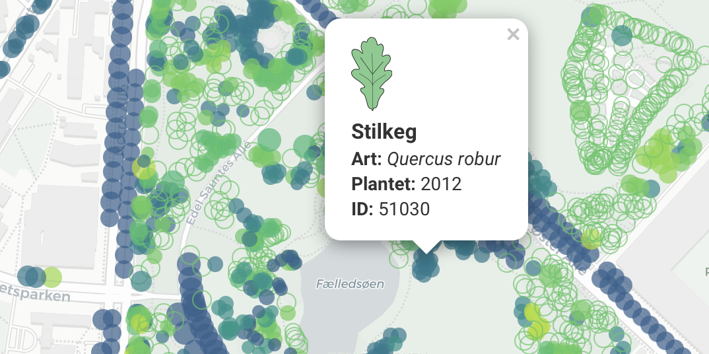

# Cleaning, QC of Copenhagen's municipal tree dataset

## Data source

The dataset from Københavns Kommune was downloaded from [Open Data DK](https://www.opendata.dk/city-of-copenhagen/trae-basis-kommunale-traeer) in September 2025. It contains information about ~67,000 trees in Copenhagen. The data (not included here) is licensed under `CC-BY-4.0`.

## Cleaning steps

- Check for duplicate UUIDs
- Flag entries with identical locations
- Check that year of planting is within an expected range
- Normalize hybrid markers (e.g. `x` to `hybr.`)
- Normalize cultivar quotes (e.g. `"` to `'`)
- Fix mistakes in scientific names (e.g. spelling, diacritics, missing species epiphet in cultivars, missing hybrid markers) according to [these rules](rules/latin_regex.csv)
- Fix mistakes in Danish names (e.g. spelling, capitalization, compound words) according to [these rules](rules/da_regex.csv)
- Separate scientific names into their logical components
- Fix Danish names based on the scientific name (incl. special Danish names for cultivars and variants) according to [these](rules/latin_da_map.csv) and [these](rules/latin_da_map_malus.csv) rules
- Fix Danish genus names based on the scientific name according to [these rules](rules/genus_dict.csv)

The last two steps assume that the scientific names are the ground truth. This is probably true in the vast majority of cases, but without knowing the history of the dataset it can't be known for certain.

The rule sets are not complete, but reflect an ongoing effort.

Approximately 20,000 changes (548 unique) have been applied to the dataset. Some corrections are counted more than once when multiple rules act in sequence, for example, “Park-Lind” → “Park-lind” → “Parklind.” All changes are listed in the [changelog](output/).

## Online Shiny-app

I used the cleaned and quality controlled dataset to develop an [interactive map](https://ktbaek.shinyapps.io/treemap_basic/) as a handy tool to explore the trees of Copenhagen. Go check it out, it's really great!

