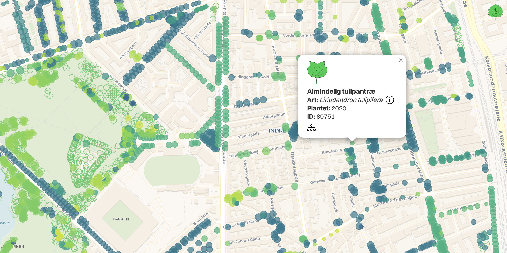

# From raw data to structured taxonomy: Copenhagen’s urban tree dataset

## Project overview
In this project I have built a clean, structured, and map-ready dataset of urban trees based on [public municipal data](https://www.opendata.dk/city-of-copenhagen/trae-basis-kommunale-traeer) from Københavns Kommune. 

The raw data contains several inconsistencies, such as missing or incorrect taxonomy, inconsistent naming, and duplicate records, which makes it difficult to use directly in applications. This repository implements a reproducible pipeline to clean, normalize, and enrich the data, and to prepare it for use in an interactive online map. 

### What the project does

- Cleans and standardizes raw tree data in R
- Builds a normalized relational database in PostgreSQL
- Outputs a dataset optimized for use in an interactive map
- Leaves an audit trail of changes made to the original data records

### Key design principles

- Scientific name is the ground truth
- All naming logic is anchored in taxonomy
- R handles data cleaning and rule-based transformations
- SQL handles relational structure and derived views
- The entire pipeline from raw data to final map dataset is scripted and reproducible

### Interactive map

I used the cleaned and quality controlled dataset to develop a beautiful and user-friendly [interactive map](https://cphtreemap.dk) using the MapLibre TypeScript library. The map is a handy tool for exploring the trees of Copenhagen.



## Data source

The dataset from Københavns Kommune was downloaded from [Open Data DK](https://www.opendata.dk/city-of-copenhagen/trae-basis-kommunale-traeer) in April 2026. It contains information about ~67,000 trees in Copenhagen. The original dataset is not included here and is licensed under `CC-BY-4.0`.

The contents of this repository (data cleaning code, validation rules, and correction methodologies) are licensed under `AGPL-3.0`.

## Data cleaning steps

### Standardization in R
- Check for duplicate UUIDs
- Flag entries with identical locations
- Check that year of planting is within an expected range
- Normalize hybrid markers (e.g. `x` to `hybr.`)
- Normalize cultivar quotes (e.g. `"` to `'`)
- Fix mistakes in scientific names (e.g. spelling, casing, diacritics, missing species epithet in cultivars, missing hybrid designations) according to [these](rules/latin_regex.csv) and [these](rules/latin_regex_malus.csv) rules

### Normalization and mapping in postgreSQL
- Separate scientific names into taxonomic components
- Create lookup tables mapping Danish common names[^1] to taxa on genus, species, and infraspecies levels
- Build a normalized taxonomy (orders → families → genera → species → infraspecies) and enforce valid taxonomic structure through constraints
- Implement common name resolution with fallback to parent taxon name when needed
- Define display rules (e.g. when to include cultivar names)
- Retain a single record per location based on data completeness (e.g. presence of taxon, planting year)

The mapping steps assumes that the scientific names are the ground truth. This is probably true in the vast majority of cases, but without knowing the history of the dataset it can't be known for certain.

Scientific names were changed for ~6000 trees (~200 unique changes), and common names were changed for ~10,000 trees (~200 unique changes). 

All changes to the raw dataset are listed in the [changelog](output/changelog).

[^1]: Anbefalede plantenavne, Ministeriet for Fødevarer, Landbrug og Fiskeri, Plantedirektoratet, 2003.

## Attribution

If you use, modify, or build upon the data cleaning methodologies and code in this repository, please include the following attribution:

```
Data cleaning methodology: Kristoffer T. Bæk (2020-2026)
https://github.com/ktbaek/Copenhagen-tree-data
Licensed under AGPL-3.0

Original tree data: © Københavns Kommune
https://www.opendata.dk/city-of-copenhagen/trae-basis-kommunale-traeer
Licensed under CC-BY-4.0
```